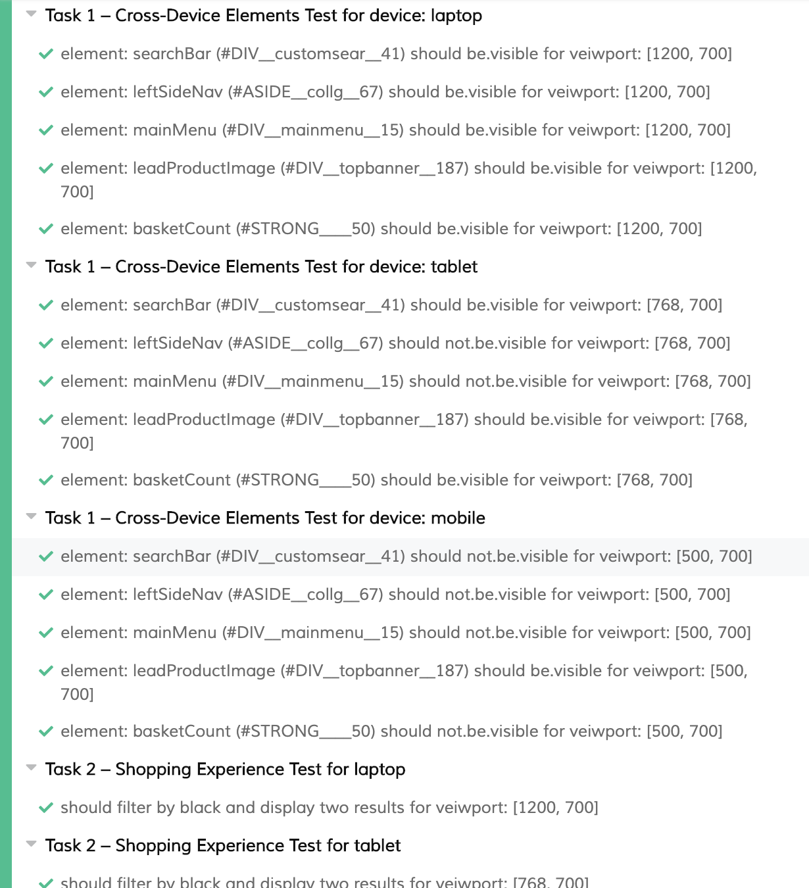
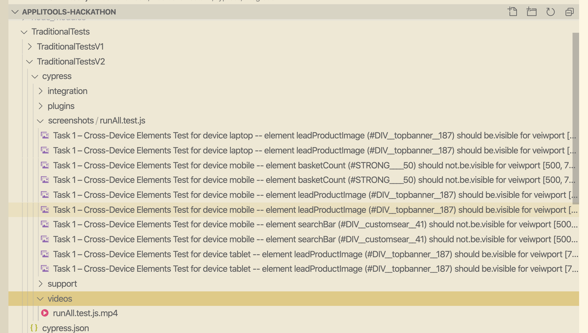

# Applitools Hackathon

Perfectly timed with lockdown and holiday! ☀️

## Dependencies Required

- Docker
- Docker Compose
- Node
- Yarn

## Getting Started

1. Run `yarn` from the root to install dependencies
2. Add applitools API key to the docker-compose files as environment vars
2. Run tests using the commands

``` javascript
 yarn test:traditionalTests:v1
 yarn test:traditionalTests:v2

 test:modernTests:v1
 test:modernTests:v2
```

### Technologies Used

- Cypress to interrogate and inspect the Dom
- Docker to run the tests in a repeatable way across machines or in CI
- Docker Compose to orchestrate running across browsers in parallel

### Time Spent

Traditional Approach - about 3 hours
Applitools Approach - about 1.5 hours

### Shortcomings

Traditional First - 
Whilst waiting for the API key I performed exploratory testing myself on the v1 website. As such I only covered a couple of the dynamic elements across the viewport opposed to them all. Adding more elements to test would be easy but I am sadly out of time 😩

Reporting -
I haven't completed the reporting to specification because personally, I feel cypress does a good enough job at leaving deterministic errors, screenshots and videos. (see below).

I have dumped the docker-compose logs out into the named files required but I am aware this is not ideal, but it does satify the requirements. 




Technology Choice -
I haven't used a VR tool for the traditional tests on purpose, this has lead to the cypress tests running on V2 not finding all the defects shown by applitools which highlights the benefits of VR testing.

Available Browsers -
Cypress only supports Chrome and Firefox for the time being so I have been unable to complete for other browsers and devices.


Cypress folder structure - The folder structure for cypress makes this project a bit confusing with so many mandatory cypress folders. I wouldn't usually have picked a folder structure like but it's in the requirements.


### Notes
I found it very hard to use `eyesCheckWindow()` with the fluent API for Cypress. I had to read through the SDK Code.

The link 
https://applitools.com/docs/topics/sdk/the-eyes-sdk-check-fluent-api.html#Defining

only describes the fluent API supporting selenium. Also `Target` is used but you don't specify what module to import it from.

in
https://github.com/applitools/eyes-cypress/blob/822d8d25b3f7a92682e9644d6c4a9c95ce9eae86/tests/fixtures/testApp/cypress/integration-play/test.js

line 21 there is 

```
    cy.eyesCheckWindow({tag: 'selector', target: 'region', selector: '.region'});

```
calling `eyesCheckWindow` with a selector property didn't seem to work for me.

I'm out of time now so will have to stop here!

Thank you for fun day!
