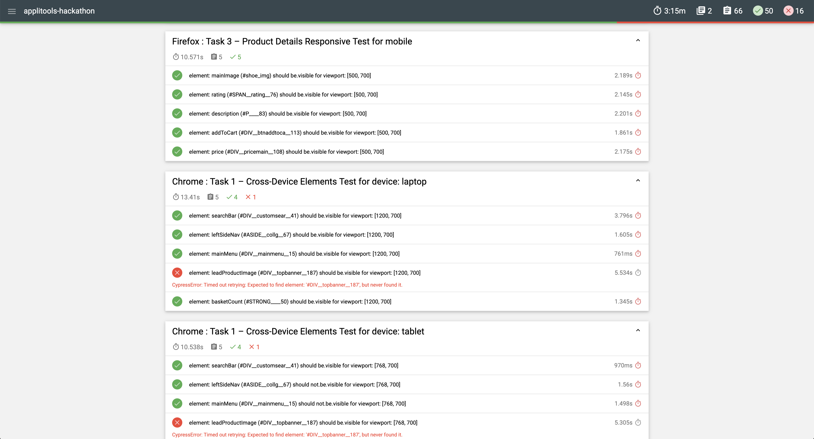

# Applitools Hackathon

Perfectly timed with lockdown and holiday! ☀️

## Dependencies Required

- Docker
- Docker Compose
- Node
- Yarn

## Getting Started

1. Run `yarn` from the root to install dependencies
2. Add applitools API key to the docker-compose files as environment vars
3. Run tests using the commands

```sh
 yarn test:traditionalTests:v1
 yarn test:traditionalTests:v2

 yarn test:modernTests:v1
 yarn test:modernTests:v2
```

### Reporting

Once the tests have run use

```sh
yarn mergeReports
yarn createReportV1
yarn createReportV2
```

### Technologies Used

- Cypress to interrogate and inspect the Dom
- Docker to run the tests in a repeatable way across machines or in CI
- Docker Compose to orchestrate running across browsers in parallel
- MochaAwesome for rich reporting

### Time Spent

- Traditional Approach - about 3 hours
- Applitools Approach - about 1.5 hours

### Shortcomings

#### Traditional First

Whilst waiting for the API key I performed exploratory testing myself on the v1 website. As such I only covered a couple of the dynamic elements across the viewport opposed to them all. Adding more elements to test would be easy but I am sadly out of time 😩

#### Tests

In Task 3 I haven't clicked on on the first product first because personally I feel it's not valuable mixing a navigation test with a test that asserts how a page visually looks when I can go to that page directly. It would add seconds to each test that ran and introduce more opportunity for test failure.

#### Reporting

I haven't completed the reporting to specification because personally, I feel a txt file is not easy to digest.
Instead I have included html reporting alongside cypress videos and screenshots (see below).




#### Technology Choice

I haven't used a VR tool for the traditional tests on purpose, this has lead to the cypress tests running on V2 not finding all the defects shown by applitools which highlights the benefits of VR testing.

#### Available Browsers

Cypress only supports Chrome and Firefox for the time being so I have been unable to complete for other browsers and devices.

#### Cypress folder structure

The folder structure cypress enforces makes this project a bit confusing with all the fixture, plugins folders etc. I wouldn't usually have picked a folder structure like.

### Notes

I found it very hard to use `eyesCheckWindow()` with the fluent API for Cypress. I had to read through the SDK Code.

The link
https://applitools.com/docs/topics/sdk/the-eyes-sdk-check-fluent-api.html#Defining

only describes the fluent API supporting selenium. Also `Target` is used but you don't specify what module to import it from.

in
https://github.com/applitools/eyes-cypress/blob/822d8d25b3f7a92682e9644d6c4a9c95ce9eae86/tests/fixtures/testApp/cypress/integration-play/test.js

line 21 there is

```
    cy.eyesCheckWindow({tag: 'selector', target: 'region', selector: '.region'});

```

calling `eyesCheckWindow` with a selector property didn't seem to work for me.

I'm out of time now so will have to stop here!

Thank you for fun day!
